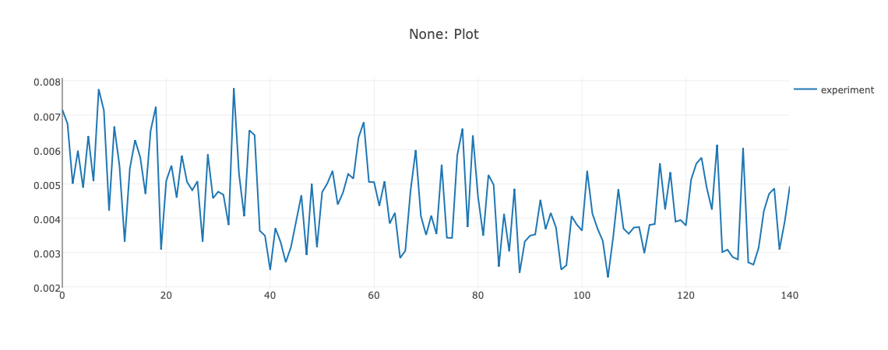
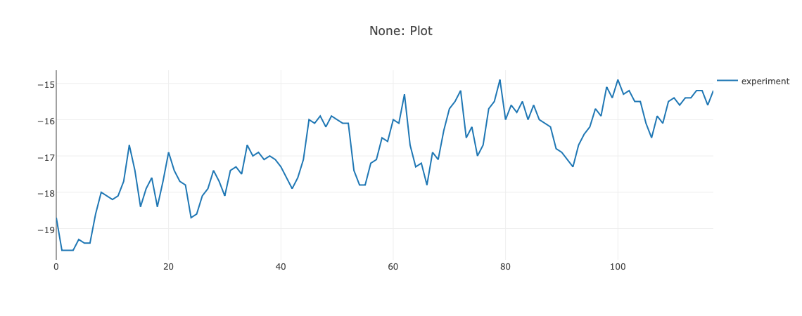

# Deep RL Bootscamp (Berkeley CA)

Link to course: [https://sites.google.com/view/deep-rl-bootcamp/home](https://sites.google.com/view/deep-rl-bootcamp/home)

## Lab 03

This Repo contains the lab 03: [https://sites.google.com/view/deep-rl-bootcamp/labs](https://sites.google.com/view/deep-rl-bootcamp/labs)

### Hyperparameters
In the following, the influence of the hyperparameters is examined. The goal is not to achieve good performance but to understand the different parameters.

**Baseline: Performance on Pong:**

| Average Return | Average Discounted Return | Average Error |
|----------------|---------------------------|---------------|
|  | ||

#### Discount Factor

**Increasing the Discount Factor gamma** (increased from 0.99 to 0.995)

| Average Return | Average Discounted Return | Average Error |
|----------------|---------------------------|---------------|
||||

**Decreasing the Discount Factor gamma** (decreased from 0.99 to 0.985)

| Average Return | Average Discounted Return | Average Error |
|----------------|---------------------------|---------------|
||||

##### Observations Discount Factor
A larger discount factor takes future conditions more into account. The plot of the return values shows that increasing the discount factor led to better results at the beginning. In the long run, however, the increase of the discount factor leads to a less steeply increasing learning curve as the baseline implementation. Furthermore, the values fluctuate more.
A reduction of the discount factor has similar values as the baseline at the beginning, but increases faster overall. This indicates that a reduction of the discount factor is reasonable and that the model for the game Pong does not have to consider as many future steps as the baseline implementation does.

**Conclusion: The discount factor should be reduced, because not so many future states have to be considered for the game Pong.**

#### Fraction of the Exploration Parameter epsilon

The parameter epsilon is reduced over time from 1 to 0.05. The fraction parameter determines how fast this reduction should take place.

**Increasing the Fraction of Expl. Parameter epsilon** (increased from 0.1 to 0.2)

| Average Return | Average Discounted Return | Average Error |
|----------------|---------------------------|---------------|
||||

**Decreasing the Fraction of Expl. Parameter epsilon** (decreased from 0.1 to 0.05)

| Average Return | Average Discounted Return | Average Error |
|----------------|---------------------------|---------------|
||||

##### Observations Epsilon
When Epsilon is bigger, the surroundings are explored more. The plots show that in this case the algorithm can learn a lot faster. For example, the model with an epsilon twice as large reaches the very good value of more than -10 after only 60 seconds, but after that the algorithm often makes wrong decisions (more random decisions) and the reward decreases. In the long run the parameter is probably better as in the baseline, but if good results should be achieved as fast as possible, then the epsilon can be increased slightly.

## Other labs
- [https://github.com/sagerpascal/deep-rl-bootcamp-lab01](https://github.com/sagerpascal/deep-rl-bootcamp-lab01)
- [https://github.com/sagerpascal/deep-rl-bootcamp-lab2](https://github.com/sagerpascal/deep-rl-bootcamp-lab2)
- [https://github.com/sagerpascal/deep-rl-bootcamp-lab4](https://github.com/sagerpascal/deep-rl-bootcamp-lab2)
