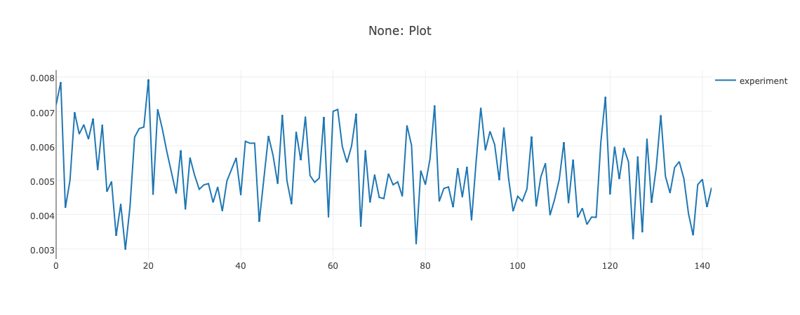

# Deep RL Bootscamp (Berkeley CA)

Link to course: [https://sites.google.com/view/deep-rl-bootcamp/home](https://sites.google.com/view/deep-rl-bootcamp/home)

## Lab 03

This Repo contains the lab 03: [https://sites.google.com/view/deep-rl-bootcamp/labs](https://sites.google.com/view/deep-rl-bootcamp/labs)

#### Hyperparameters
In the following, the influence of the hyperparameters is examined. The goal is not to achieve good performance but to understand the different parameters.

**Baseline: Performance on Pong:**

Average Return:

Average Discounted Return:

Average Error:

**Increasing the Discount Factor gamma** (increased from 0.99 to 0.995)
Average Return:

Average Discounted Return:

Average Error:

**Decreasing the Discount Factor gamma** (decreased from 0.99 to 0.985)

Average Return:

Average Discounted Return:

Average Error:

**Increasing the Fraction of Expl. Parameter epsilon** (increased from 0.1 to 0.2)

Average Return:

Average Discounted Return:

Average Error:

**Decreasing the Fraction of Expl. Parameter epsilon** (decreased from 0.1 to 0.05)

Average Return:

Average Discounted Return:

Average Error:

## Other labs
- [https://github.com/sagerpascal/deep-rl-bootcamp-lab01](https://github.com/sagerpascal/deep-rl-bootcamp-lab01)
- [https://github.com/sagerpascal/deep-rl-bootcamp-lab2](https://github.com/sagerpascal/deep-rl-bootcamp-lab2)
- [https://github.com/sagerpascal/deep-rl-bootcamp-lab4](https://github.com/sagerpascal/deep-rl-bootcamp-lab2)
